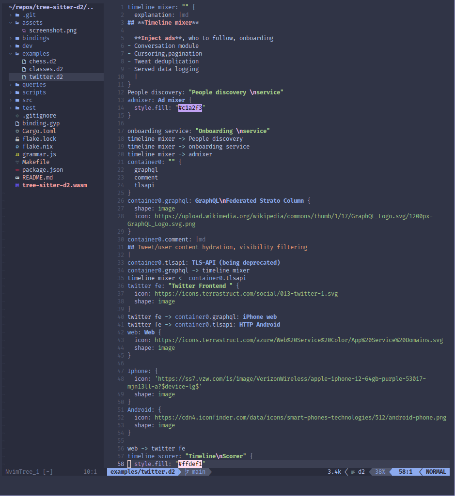
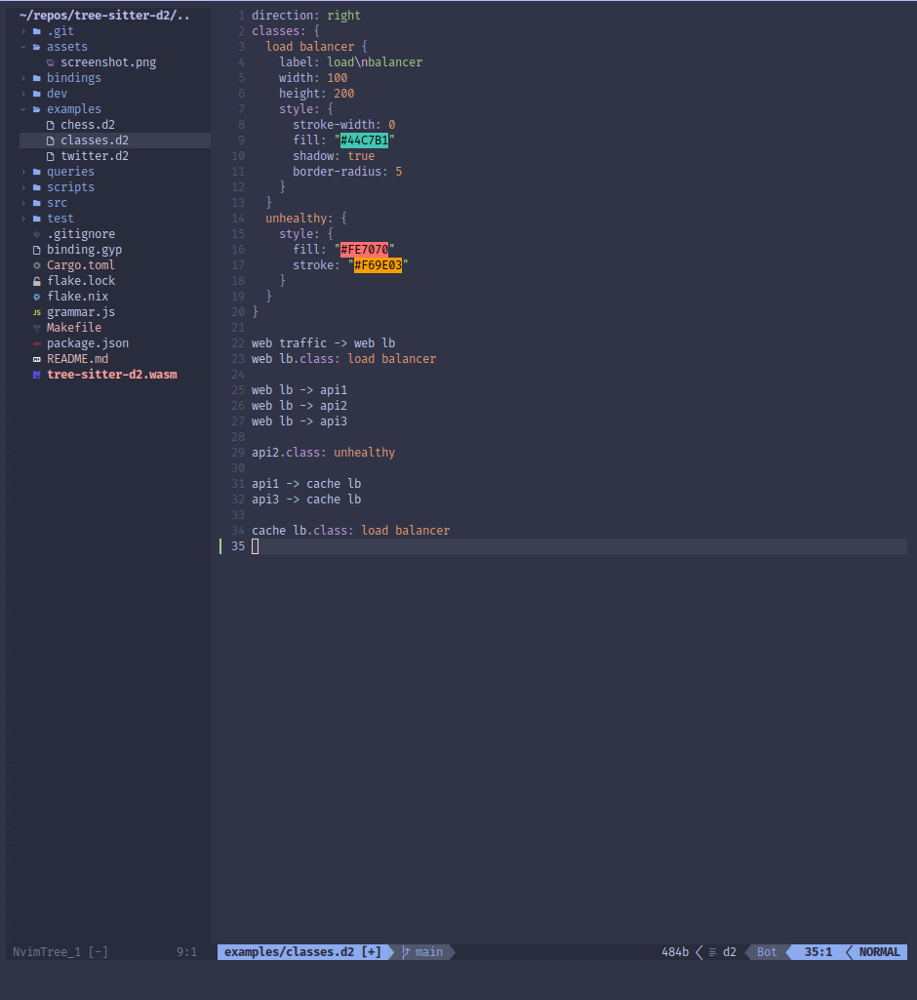

# tree-sitter-d2

D2 grammar for tree-sitter.

References:

- https://d2lang.com/

## Highlights





# Install

## Neovim

Using `nvim-treesitter`, add to your configuration

```lua
local parser_config = require("nvim-treesitter.parsers").get_parser_configs()
parser_config.d2 = {
  install_info = {
    url = 'https://git.pleshevski.ru/pleshevskiy/tree-sitter-d2',
    revision = 'main',
    files = { 'src/parser.c', 'src/scanner.c' },
  },
  filetype = 'd2',
};
```

# Mirrors

- [Git Pleshevski](https://git.pleshevski.ru/pleshevskiy/tree-sitter-d2)
- [Codeberg](https://codeberg.org/p8i/tree-sitter-d2)
